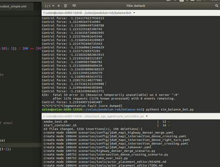
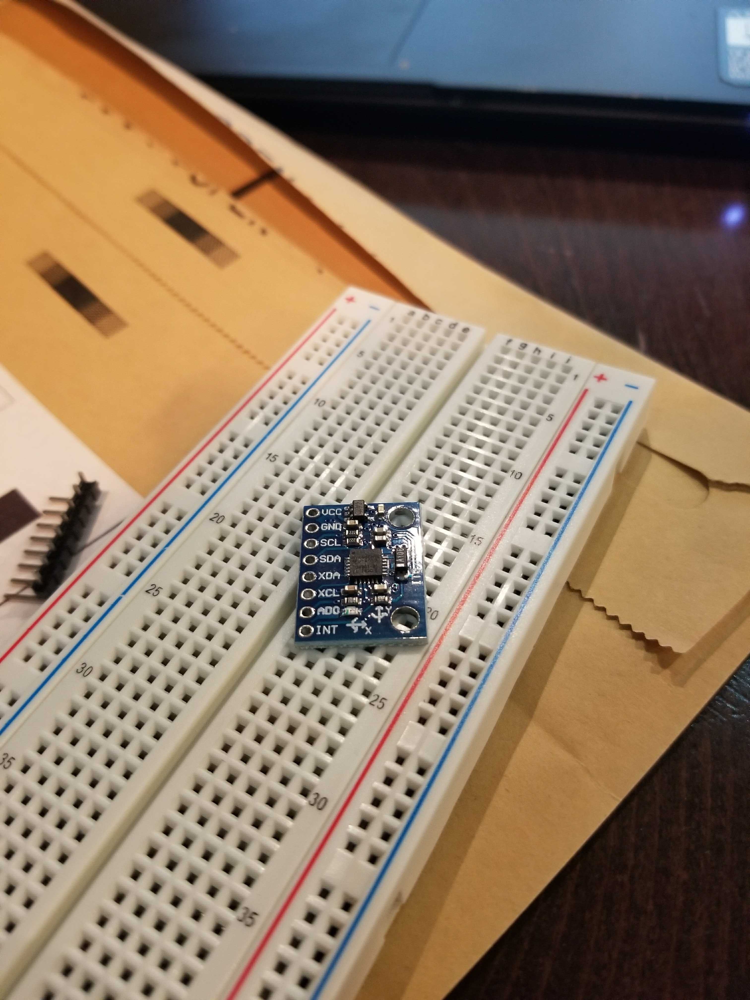
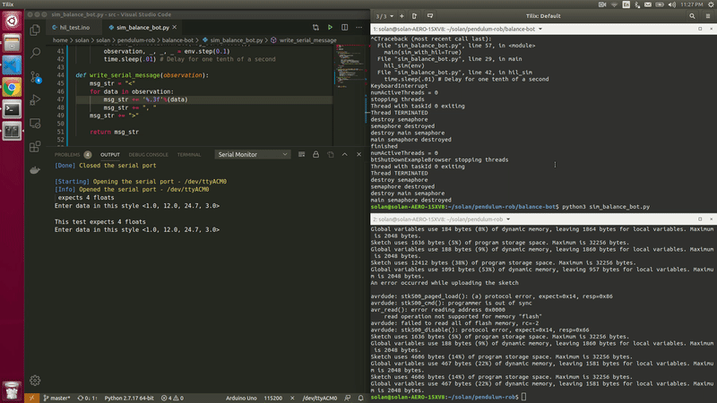
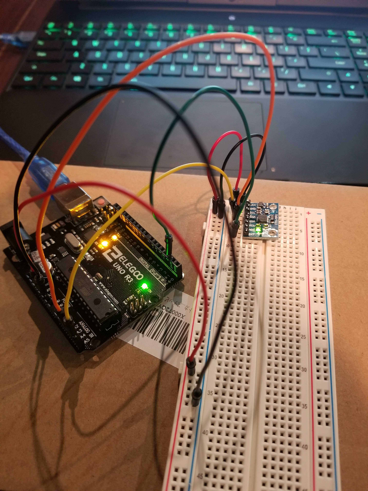
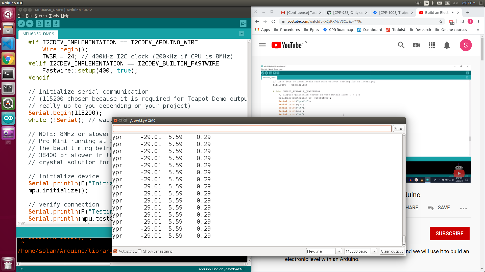

**22/04/2020:**
 - downloaded balance bot repo based on open ai gym. code comments would be nice :)
 - got rid of the reinforcement learning framework.
 - started writing up an lqr controller in python. first steps...
 - ...after a couple sign flips, the lqr works!!

 

**23/04/2020:**
 - imu has arrived (mpu-6050)! tried hooking it up but couldn't get solid contact with the pins. soldering iron on the way...

 
 
 - in the meantime, going to set up a little hardware-in-the-loop sim.
 - first step is to get serial communication working in python.
 - serial comm to the uno is working with a simple protocol. i only seem to get 2 decimal precision though...

 

**25/04/2020:**
 - plan for today: get arduino->pc comm working, implement lqr on arduino, see if hil sim works!
 - 2-decimal floating issue was because Serial.print() by default prints to two decimals.
 - LQR is implemented on the uno, but deseriializing messages in python is not working well. need to implement a better protocol...

**30/04/2020:**
 - soldered leads to imu.

 

 - and it works!
 
 
